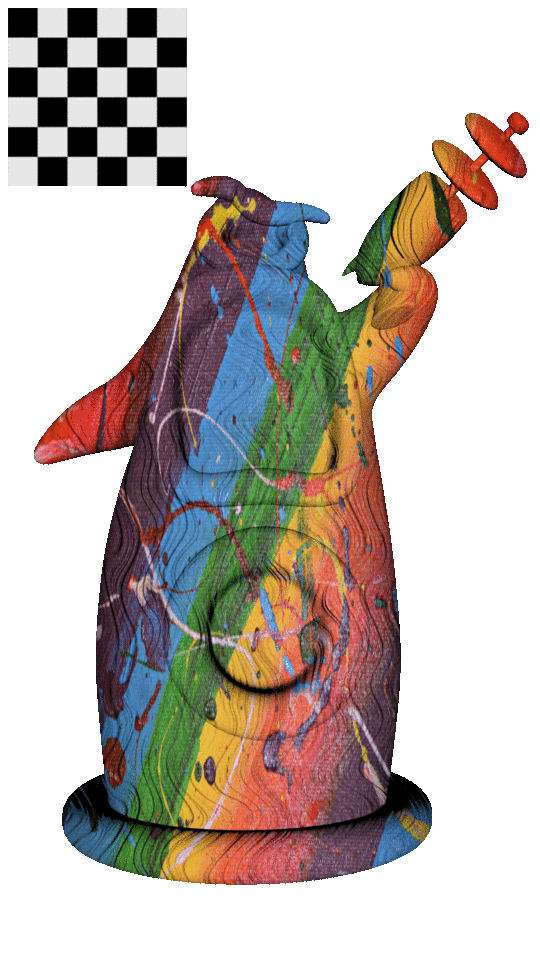
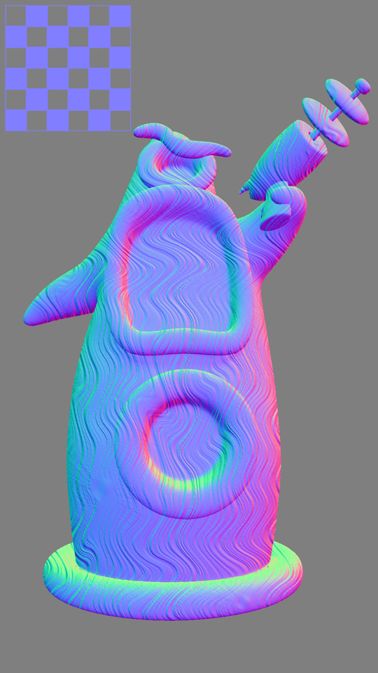
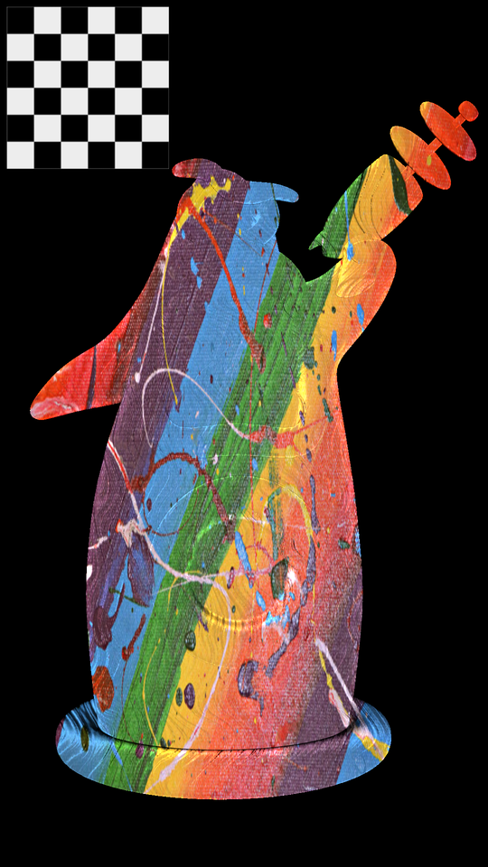
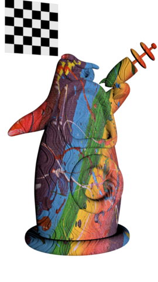
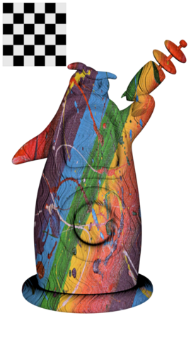
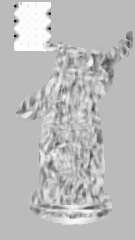
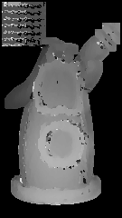

**Warning!** If you fork this repo, make sure you make it private.  Pushing your solutions to a public repository is an academic integrity violation.

# PA4: Stereo

This assignment will exercise the concepts of **two-view stereo** and **photometric stereo**.  The project contains three parts.  You are expected to implement parts 1 and 2.  We will give you the code to do part 3.

1. **[Photometric stereo](#part-1-photometric-stereo)**.  Given a stack of images taken from the same viewpoint under different, known illumination directions, your task is to recover the albedo and normals of the object surface.
2. **[Plane-sweep stereo](#part-2-plane-sweep-stereo)**.  Given two calibrated images of the same scene, but taken from different viewpoints, your task is to recover a rough depth map.
3. **[Depth map estimation](#part-3-depth-map-reconstruction)**. Given a normal map, depth map, or both, reconstruct a 3D mesh.

**You are to implement your code in student.py.  Inputs and outputs for each function are specified in student.py.**

## Getting Started
Execute the following script to download the required datasets.  This might take awhile depending on your connection, so please be patient.  We've commented out datasets you don't need in order to complete this assignment to save download time, but we encourage you to download them to try out many different inputs.
```
cd data
sh download.sh
```

This repository comes with the ```tentacle``` dataset.  You will need to execute the download script to get the other datasets.  For visualizations of the other datasets, please visit these external sites:
* [Middlebury Stereo](http://vision.middlebury.edu/stereo/data/scenes2014/)
* [Harvard Photometric Stereo](http://vision.seas.harvard.edu/qsfs/Data.html)

You will need ImageMagick, MeshLab and nose. If you are using the class VM then run:

```
sudo apt-get install imagemagick meshlab python-nose
```

## Part 1: Photometric stereo
Given a stack of images taken from the same viewpoint under different, known illumination directions, your task is to recover the albedo and normals of the object surface.
### Quickstart
```
python photometric_stereo.py <dataset>
```
where dataset is in:
```('tentacle', 'cat', 'frog', 'hippo', 'lizard', 'pig', 'scholar', 'turtle')```

For example, if you use the tentacle dataset:
```
python photometric_stereo.py tentacle
```
the output will be in ```output/tentacle_{normals.png,normals.npy,albedo.png}```.

The following illustrates the different illuminations for the tentacle dataset.  The tentacle is a 3D mesh that has been rendered under 9 different directional illumination settings.


Correct ```tentacle_normals.png``` for the tentacle dataset looks like:



Red indicates the normal is pointing to the right (+x direction), green indicates the normal is pointing up (+y direction) and blue indicates the normal is pointing out of the screen (+z direction).  **We expect for you to format your normals in this coordinate frame.**  Failure to do so will result in incorrect meshes in part 3 of this assignment.  The lighting directions we provide are already in this coordinate frame, so the simplest solution should be correct by default.

Correct ```tentacle_albedo.png``` for the tentacle dataset looks like:



### TODO
1. Implement student.py:compute_photometric_stereo_impl.  This function should take about 0.5-20 seconds to compute a result for the tentacle dataset depending on your implementation.  Aim for 2 seconds.
2. The output for the tentacle dataset should match our solution.
3. Your function should pass the [provided test cases](#testing).
4. Run and record your output for the 'tentacle' dataset and the 'cat' dataset.  Include ```output/{tentacle,cat}_normals.png``` and ```output/{tentacle,cat}_albedo.png```.

## Part 2: Plane-sweep stereo
Given two calibrated images of the same scene, but taken from different viewpoints, your task is to recover a rough depth map.
### Quickstart
```
python plane_sweep_stereo.py <dataset>
```
where dataset is in:
```('tentacle', 'Adirondack', 'Backpack', 'Bicycle1', 'Cable', 'Classroom1', 'Couch', 'Flowers', 'Jadeplant', 'Mask', 'Motorcycle', 'Piano', 'Pipes', 'Playroom', 'Playtable', 'Recycle', 'Shelves', 'Shopvac', 'Sticks', 'Storage', 'Sword1', 'Sword2', 'Umbrella', 'Vintage')```

For example, if you use the tentacle dataset:
```
python plane_sweep_stereo.py tentacle
```
the output will be in ```output/tentacle_{ncc.png,ncc.gif,depth.npy,projected.gif}```.

The following illustrates the two views for the tentacle dataset.



Correct ```tentacle_projected.gif``` for the tentacle dataset looks like:


This animated gif shows each rendering of the scene as a planar proxy is swept away from the camera.

Correct ```tentacle_ncc.gif``` for the tentacle dataset looks like:



This animated gif illustrates slices of the NCC cost volume where each frame corresponds to a single depth.  White is high
NCC and black is low NCC.

and correct ```tentacle_ncc.png``` for the tentacle dataset looks like:



This illustrates the argmax depth according to the NCC cost volume.  White is near and black is far.

### TODO
1. Implement the following functions in student.py (We've configured the tentacle dataset such that it takes about 0.5-100 seconds to compute depending on your implementation.  Aim for 10 seconds.):
    * pyrdown_impl
    * pyrup_impl
    * unproject_corners_impl
    * project_impl
    * preprocess_ncc_impl
    * compute_ncc_impl
2. The output for the tentacle dataset should match our solution.
3. Your function should pass the [provided test cases](#testing).
4. Run and record your output for the 'tentacle' dataset and the 'Flowers' dataset.  Include ```output/{tentacle,Flowers}_ncc.png```.

**Protip.** Debugging taking too long on the provided examples?  Go into ```dataset.py``` where you can edit a couple arguments.  You can decrease the number of depth layers in the cost volume.  For example, the Middlebury datasets are configured to use 128 depth layers by default:
```
self.depth_layers = 128
```
Alternatively, you can decrease the resolution of the input images.  For example, the Middlebury datasets are downscaled by a factor of 4 by default:
```
self.stereo_downscale_factor = 4
```
The output image will be of dimensions ```(height / 2^stereo_downscale_factor, width / 2^stereo_downscale_factor)```.

## Part 3: Depth map reconstruction
Given a normal map, depth map, or both, reconstruct a mesh.
### Quickstart
```
python combine.py <dataset> <mode>
```
where dataset is in:
```('tentacle', 'cat', 'frog', 'hippo', 'lizard', 'pig', 'scholar', 'turtle', 'Adirondack', 'Backpack', 'Bicycle1', 'Cable', 'Classroom1', 'Couch', 'Flowers', 'Jadeplant', 'Mask', 'Motorcycle', 'Piano', 'Pipes', 'Playroom', 'Playtable', 'Recycle', 'Shelves', 'Shopvac', 'Sticks', 'Storage', 'Sword1', 'Sword2', 'Umbrella', 'Vintage')```

and mode is in:
```('normals', 'depth', 'both')```

For example, if you use the tentacle dataset:
```
python combine.py tentacle both
```
the output will be in ```output/tentacle_mesh_both.ply```.  This should take about <2 minutes to compute.

The tentacle dataset is the only one compatible with the ```both``` option.  Other datasets are compatible with either the ```normals``` mode (photometric stereo integration) or the ```depth``` mode (mesh from depth).

The following video illustrates the expected output for the tentacle dataset.  Use Meshlab to open and view the mesh.  
[](https://www.youtube.com/watch?v=l8rtCo3DGRw "Tentacle Mesh")

**Protip.** Use the ```Import Mesh``` button in Meshlab to open your mesh.

### TODO
1. There's no code to implement.  We give you everything you need.
2. For each of these dataset and mode combinations, run the code, view the mesh in Meshlab, take a screenshot, and briefly describe which parts of each mesh look good and which parts have clear mistakes.  Try to give a brief description of why you think either the photometric stereo or plane sweep stereo algorithms made mistakes.
   * ```tentacle``` dataset with mode set to ```both```
   * ```tentacle``` dataset with mode set to ```depth```
   * **(Optional)** ```tentacle``` dataset with mode set to ```normals``` **We expect this to be very slow.  Compute and examine the result if you're curious, but we don't expect you to turn it in.** 
   * ```cat``` dataset with mode set to ```normals```
   * ```Flowers``` dataset with mode set to ```depth```

Be patient when running combine.py.  For reference, the whole thing should run on the ```tentacle``` dataset with the ```both``` option in under 20 seconds.

# Testing
Execute ```nosetests``` from the project directory to run the provided test cases in ```tests.py```.

When you run ```nosetests``` for the first time, you'll see that all the tests are skipped.
```
SSSSSSSSSSSSSSSSSSSSSSSSSSSSSSSSSSSSSSSS
----------------------------------------------------------------------
Ran 40 tests in 0.869s

OK (SKIP=40)
```
We've configured tests.py to skip any tests where a NotImplementedError has been raised.  Skipped tests are shown as a ```S```.
After implementing one function, you might see something like this.
```
SSSSSSSSSSSSSSSSSSSSSSSSSSSSSSSSSSSS...S
----------------------------------------------------------------------
Ran 40 tests in 0.639s

OK (SKIP=37)
```
Here we have passed three tests, each indicated by a ```.```.

If you fail a test case, then a ```F``` will be printed.  For example:
```
SSSSSSSSSSSSSSSSSSSSSSSSSSSSSSSSSSSSFFFS
======================================================================
FAIL: tests.unproject_Rt_identity_1x1_test
----------------------------------------------------------------------
Traceback (most recent call last):
  File "/Users/kmatzen/anaconda/lib/python2.7/site-packages/nose/case.py", line 197, in runTest
    self.test(*self.arg)
  File "/Users/kmatzen/cs4670/pa4/tests.py", line 15, in wrapper
    func()
  File "/Users/kmatzen/cs4670/pa4/tests.py", line 385, in unproject_Rt_identity_1x1_test
    assert (point[0, 0, 0] == -0.5).all()
AssertionError
...
----------------------------------------------------------------------
Ran 40 tests in 0.885s

FAILED (SKIP=37, failures=3)
```

As you work on implementing your solution, we recommend that you extend tests.py with whatever new test cases you feel will help you debug your code.

# Turn In
To recap, you must:
* Complete student.py
* Make sure you pass the provided test cases
* Include the requested outputs from parts 1 and 2
* Include the screenshots and brief descriptions from part 3

---
done :relieved:


